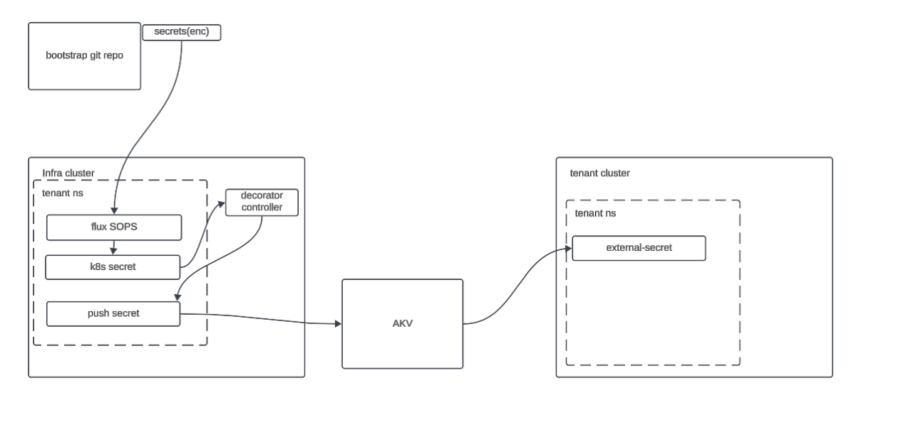

# Tenant Secret Self Service

This outlines a way to handle secret self service when the multitenant gitops setup describe in the [flux tmc multitenant setup](https://github.com/warroyo/flux-tmc-multitenant) 

One of the challenges with this setup is allows tenants to bootstrap their own secret stores. The process in that repo outlines how to create a cluster wide store, but due to the way that permissions are setup in Azure Key Vault it's not easy to provide tenants access to that cluster wide store to setup their own secrets. This leads to the other approach outlined in that document that describes having tenants setup their own `secretStores` that are namespaced, but this still requires a boostrap secret of some kind usually. The current approach to handling this would be to give the platform admin the secret and have them place it into the cluster wide secret store, this creates a bottle neck. The approach outlined in the rest of this document tackles this problem with a self service setup, allowing tenants to use their existing bootstrap repos to also add bootstrap secrets into the cluster wide store that can then be used to connect to their existing secret stores using extertnal secrets. This only needs to be setup in one cluster, in the multitenant setup we refer to the as the infra-ops cluster. This will centralize the management of the self service secrets and then allow the worload clusters to be able to only pull secrets from the allowed secret stores. 


# Architecture



# Pre-Reqs

Ideally this is to be used with the seyup mentioned above in the [flux tmc multitenant setup](https://github.com/warroyo/flux-tmc-multitenant) . However this could be used in any cluster with flux and external secrets. This only needs to be setup in one cluster, in the multitenant setup we refer to the as the infra-ops cluster. 

* Flux   
* External Secrets Operator
* AKV with some vaults created 
* Carvel Secret Gen controller
* Metacontroller
* age

# Setup

This example will use 2 different AKVs one for dev and one for test. 

## Bootstrap the cluster to be able to access AKV

This can be done many different ways, in this example we are going to use TMC's clustergroup level secret to create the Azure SP that will be used in the ClusterSecretStores. This could also be done manually in the cluster or through some other automation.


1. copy the secret template and add your SP credentials and then apply it to tmc.

```
cp tmc/secrets/azure-sp-bootstrap.yaml tmc/secrets/azure-sp-bootstrap-real.yaml
tanzu tmc secret create -f tmc/secrets/azure-sp-bootstrap-real.yaml -s clustergroup
```


## Generate the GPG key and add it to one of the Vaults.

This step generates the AGE key that will be used by SOPS. This will be stored in AKV and retrieved with external secrets, the vault that this is stored in should be the one that your infra-ops cluster has access to. The full guide can be found [here](https://fluxcd.io/flux/guides/mozilla-sops/) . Note, we will be using `age` instead of PGP.

1. Generate the AGE key

```bash
age-keygen -o age.agekey
```

2. create the akv secret with the age key
```bash
cat age.agekey |base64  | tr -d '\n' |az keyvault secret set --vault-name "<vault-name>" --name "sops-gpg" --file /dev/stdin
```

3. move the age key to our sops folder

```bash
mkdir -p ~/.sops
mv age.agekey ~/.sops/key.txt
```

## Create the cluster secret stores

This will create the base cluster secret stores for the two environments. In a full flux setup this would not be done manually and would just be part of the infra cluster's flux repo.

1. update the tenant id and vault urls in the `flux/css.yml` file and apply it.
```bash
kubectl apply -f flux/css.yml
```

## Create the AGE key secret in the cluster

 This will use an external secret to pull the GPG key into the external-secrets namespace as well as create a secret export to make it available to be imported into the tenant namepsaces for use by flux. In a full flux setup this would not be done manually and would just be part of the infra cluster's flux repo.

 ```bash
kubectl apply -f flux/age-key.yaml
```

## Install the decorator controller

The decorator controller is a simple controller that uses metacontroler. This decorator watches for secrets to be created with specific labels and then creates a push-secret that is associated with that secret, this allow the secret to be automatically pushed to the AKV store. To keep this as flexible as possible the entire k8s secret will be pushed as json to the key vault into it's "value" field. This means the secret can easily be retireved and extractyed using an externanl secret. 

```bash
kubectl apply -k push-secret-decorator/manifest`
```

## apply the tenant specific resources

The tenant specific resources in a full flux setup this would not be done manually and would just be part of the infra cluster's flux repo. These will create the flux kustomization and git repo that sync the tenant's bootstrap repo into the cluster and create the namespaced secrets that will then be uploaded to keyvault. This kustomization also patches the secrets to add the required information so that the tenant does not need any extra info for the push secret to work. 

```bash
kubectl apply -f flux/tenant-secrets
```


## Test it out using a bootstrap repo
There is an exmaple bootstrap repo created [here](https://github.com/warroyo/iris-blue-gitops). The secrets folder is what is being watched by the kustomizations cerated in the previous step. specifically this is using environment based paths(dev.test,etc.) this just needs to match the kustomization setup. In each folder you will see encrypted k8s secrets, this is using the process descibed [here](https://fluxcd.io/flux/guides/mozilla-sops/#encrypting-secrets-using-age).  There are also helpful plugins for vscode etc. that can be used to automatically decrypt. [This plugin](https://marketplace.visualstudio.com/items?itemName=signageos.signageos-vscode-sops) is very helpful for vscode 


Since this will be tenants doing the encryption, this age public key will need to be shared with the tenants. Assuming we have a k8s secret ina file called `basic-auth.yml`  this would be the command to encrypt it. This can then be commited into git. 

```
sops --age=age1helqcqsh9464r8chnwc2fzj8uv7vr5ntnsft0tn45v2xtz0hpfwq98cmsg \
--encrypt --encrypted-regex '^(data|stringData)$' --in-place basic-auth.yaml
```

sops --age=age1cakes7y3xval6tat3qquvhwqdpltmp3dpa0ajs6q8932pr7y845s92au27 \
--encrypt --encrypted-regex '^(data|stringData)$' --in-place 